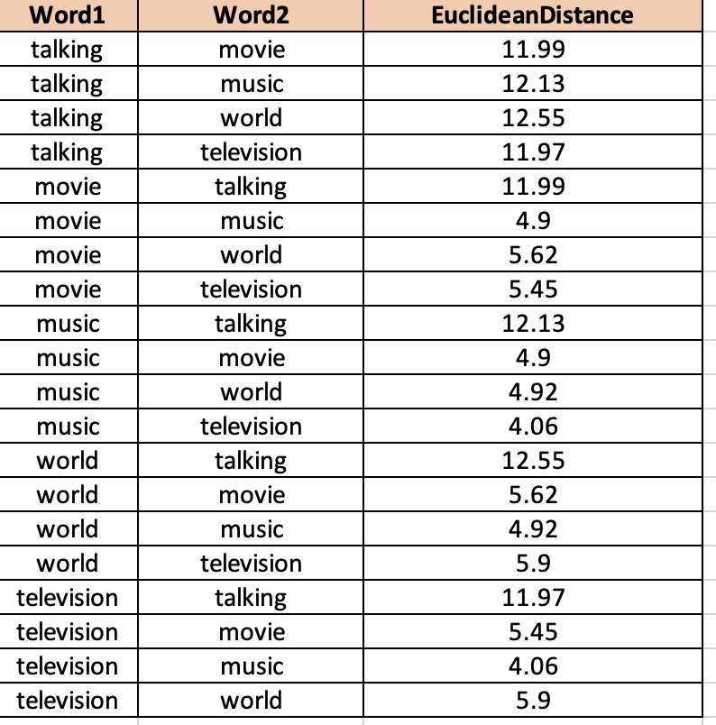
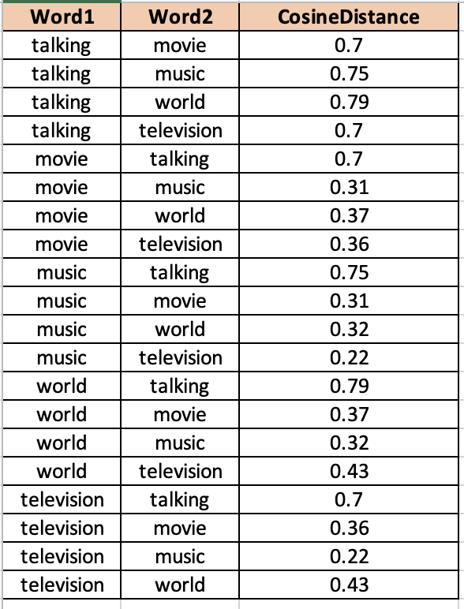

## Assignment 2 , Advanced NLP
## Roll No - 2020900039

#### For following 5 words, I have calculated the following distances between ELMO embeddings 

    1. talking
    2. movie
    3. music
    4. world
    5. television

